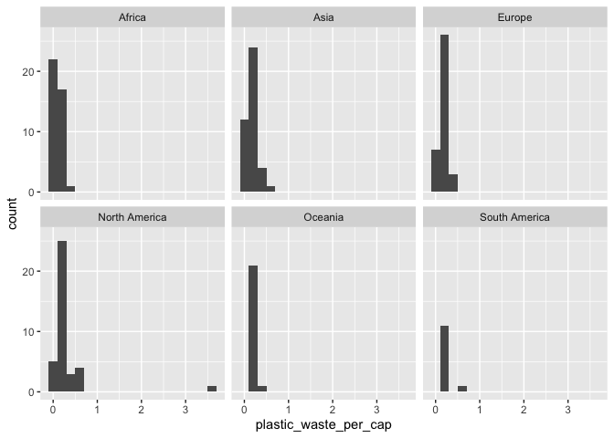
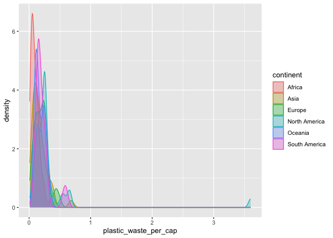
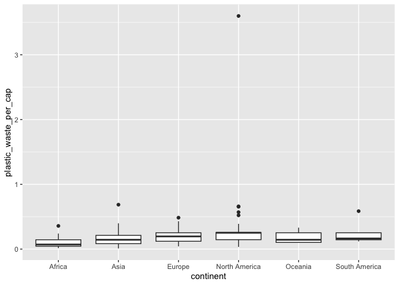
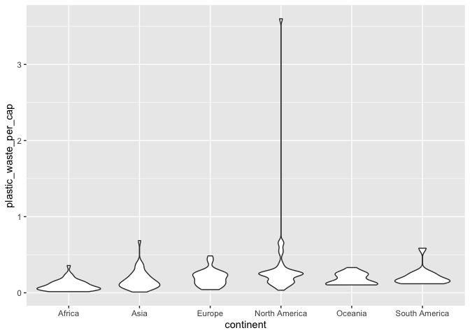
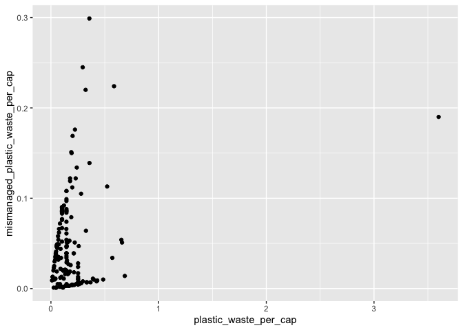
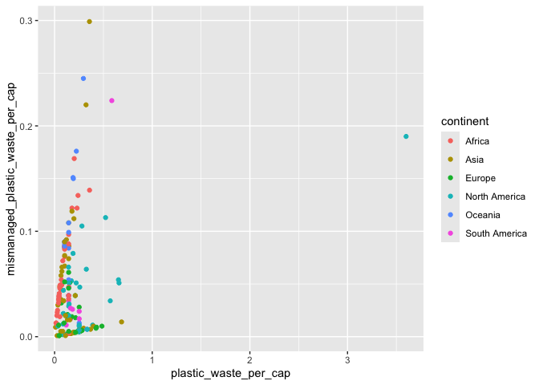
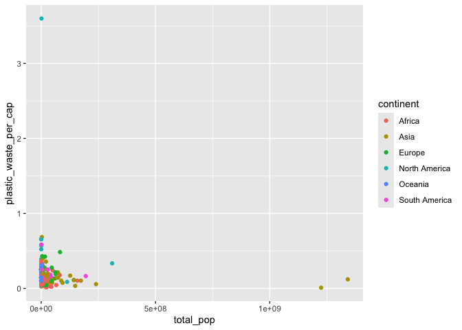
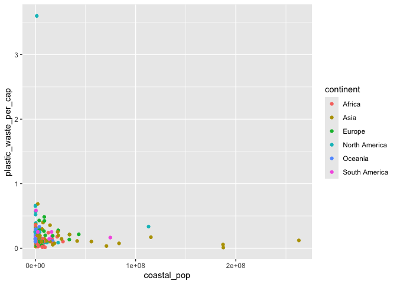
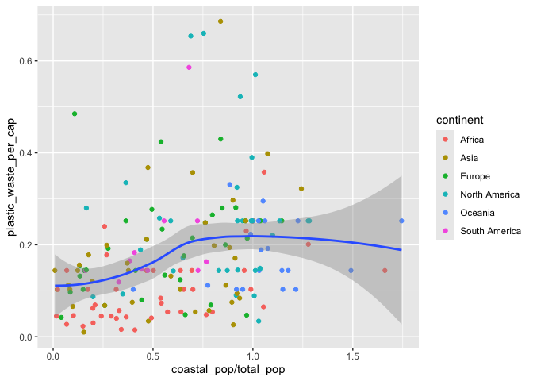

Lab 02 - Plastic waste
================
Barbara Mu
21/01/2026

## Load packages and data

``` r
library(tidyverse) 
library(ggplot2)
```

``` r
plastic_waste <- read.csv("data/plastic-waste.csv")
```

## Exercises

### Exercise 1

``` r
summary(plastic_waste)
```

    ##      code              entity           continent              year     
    ##  Length:240         Length:240         Length:240         Min.   :2010  
    ##  Class :character   Class :character   Class :character   1st Qu.:2010  
    ##  Mode  :character   Mode  :character   Mode  :character   Median :2010  
    ##                                                           Mean   :2010  
    ##                                                           3rd Qu.:2010  
    ##                                                           Max.   :2010  
    ##                                                                         
    ##   gdp_per_cap       plastic_waste_per_cap mismanaged_plastic_waste_per_cap
    ##  Min.   :   660.2   Min.   :0.0100        Min.   :0.00100                 
    ##  1st Qu.:  3816.0   1st Qu.:0.1030        1st Qu.:0.00600                 
    ##  Median : 10436.4   Median :0.1440        Median :0.03200                 
    ##  Mean   : 17682.6   Mean   :0.1965        Mean   :0.04501                 
    ##  3rd Qu.: 23107.8   3rd Qu.:0.2520        3rd Qu.:0.06600                 
    ##  Max.   :125140.8   Max.   :3.6000        Max.   :0.29900                 
    ##  NA's   :45         NA's   :51            NA's   :51                      
    ##  mismanaged_plastic_waste  coastal_pop          total_pop        
    ##  Min.   :      1          Min.   :      596   Min.   :5.000e+01  
    ##  1st Qu.:   2245          1st Qu.:   257904   1st Qu.:5.324e+05  
    ##  Median :  16259          Median :  1986723   Median :5.413e+06  
    ##  Mean   : 171570          Mean   : 10944247   Mean   :3.094e+07  
    ##  3rd Qu.:  80759          3rd Qu.:  7573074   3rd Qu.:1.970e+07  
    ##  Max.   :8819717          Max.   :262892387   Max.   :1.341e+09  
    ##  NA's   :51               NA's   :51          NA's   :10

``` r
ggplot(data = plastic_waste, aes(x = plastic_waste_per_cap)) + 
  geom_histogram(binwidth = 0.2) + 
  facet_wrap(~continent)
```

    ## Warning: Removed 51 rows containing non-finite outside the scale range
    ## (`stat_bin()`).

<!-- --> These
histograms reveal that the distribution of plastic waste per capita is
right-skewed across all continents, with distinct regional patterns.
North America stands out due to an extreme point exceeding 3.0kg/day,
suggesting a much higher rate of plastic waste generation than any other
nation in the dataset. Additionally, Oceania and South America (perhaps
as well as Africa) exhibit the least variability, with distributions
tightly compressed in the lowest bins, indicating consistently low waste
generation compared to the wider spreads seen in Europe and Asia.

### Exercise 2

``` r
ggplot(
  data = plastic_waste,
  mapping = aes(
    x = plastic_waste_per_cap,
    color = continent,
    fill = continent
  )
) +
  geom_density(alpha = 0.3)
```

    ## Warning: Removed 51 rows containing non-finite outside the scale range
    ## (`stat_density()`).

<!-- --> We
defined ‘color’ and ‘fill’ inside the aesthetic mapping because we want
them to vary based on the data. Specifically, we want a different color
and fill for each unique value in the continent variable. By placing
them inside aes(), we tell ggplot2 to map the data variable to the
visualize properties. As for ‘alpha level’, we defined it as a
characteristic of the plotting outside of aes() because we want it to
remain constant for the entire plot. In other words, we are not mapping
transparency to a specific variable, e.g., setting Africa more
transparent than Aisa; we are setting the transparent level for all the
density plots for all continents.

### Exercise 3

``` r
ggplot(
  data = plastic_waste,
  mapping = aes(
    x = continent,
    y = plastic_waste_per_cap
  )
) +
  geom_boxplot()
```

    ## Warning: Removed 51 rows containing non-finite outside the scale range
    ## (`stat_boxplot()`).

<!-- -->

``` r
ggplot(
  data = plastic_waste,
  mapping = aes(
    x = continent,
    y = plastic_waste_per_cap
  )
) +
  geom_violin()
```

    ## Warning: Removed 51 rows containing non-finite outside the scale range
    ## (`stat_ydensity()`).

<!-- --> Violin
plots show the entire density distribution of the data. They reveal the
shape of the data, its distribution (skewed or uniform). A box plot
compresses this information into a simple rectangle, potentially hiding
these nuances. However, box plots explicitly mark specific summary
statistics and outliers. We can easily see the median, the interquartile
range, and potential outliers. While we can infer the general range from
a violin plot, it does not strictly identify outliers or exact quartile
values.

### Exercise 4

``` r
ggplot(data = plastic_waste, aes(x = plastic_waste_per_cap, y = mismanaged_plastic_waste_per_cap)) + 
  geom_point()
```

    ## Warning: Removed 51 rows containing missing values or values outside the scale range
    ## (`geom_point()`).

<!-- --> The
scatterplot shows a positive relationship between mismanaged plastic
waster and plastic waster per capita，where higher plastic waster per
capita correlates with higher mismanaged waste, though the relationship
is large likely to be driven by a cluster of countries with low values
for both.

``` r
ggplot(data = plastic_waste, aes(x = plastic_waste_per_cap, y = mismanaged_plastic_waste_per_cap, color = continent)) + 
  geom_point() 
```

    ## Warning: Removed 51 rows containing missing values or values outside the scale range
    ## (`geom_point()`).

<!-- -->
From the color-filtered plot, the distinctions between continents are
clearer - the correlation between plastic waster per capit and
mismanaged plastic waste seems to be less positive in North America and
Europe than other continents.

``` r
ggplot(data = plastic_waste, aes(x = total_pop, y = plastic_waste_per_cap, color = continent)) + geom_point()
```

    ## Warning: Removed 61 rows containing missing values or values outside the scale range
    ## (`geom_point()`).

<!-- -->

``` r
ggplot(data = plastic_waste, aes(x = coastal_pop, y = plastic_waste_per_cap, color = continent)) + geom_point()
```

    ## Warning: Removed 51 rows containing missing values or values outside the scale range
    ## (`geom_point()`).

<!-- -->
In my opinion, neither shows a strongly linear association. In both
plots, the data is heavily clustered in the bottom-left corner,
indicating that some continents have both small populations and low
plastic waste per capita. In this way, whether total or coastal, does
not appear to be a good linear predictor of how much plastic waste a
country generates.

### Exercise 5

``` r
plastic_waste %>%
  filter(plastic_waste_per_cap < 3) %>%
  ggplot(aes(x = coastal_pop / total_pop, y = plastic_waste_per_cap)) +
  geom_point(aes(color = continent)) + 
  geom_smooth()
```

    ## `geom_smooth()` using method = 'loess' and formula = 'y ~ x'

    ## Warning: Removed 10 rows containing non-finite outside the scale range
    ## (`stat_smooth()`).

    ## Warning: Removed 10 rows containing missing values or values outside the scale range
    ## (`geom_point()`).

<!-- --> Noticeably, some
data points show a coastal population proportion exceeding 1.0, which is
mathematically impossible. Beyond this observed data validity, the trend
line is relatively flat with high variability, indicating that there is
no strong linear association between the percentage of the population
living near the coast and the amount of plastic waste generated per
capita.
